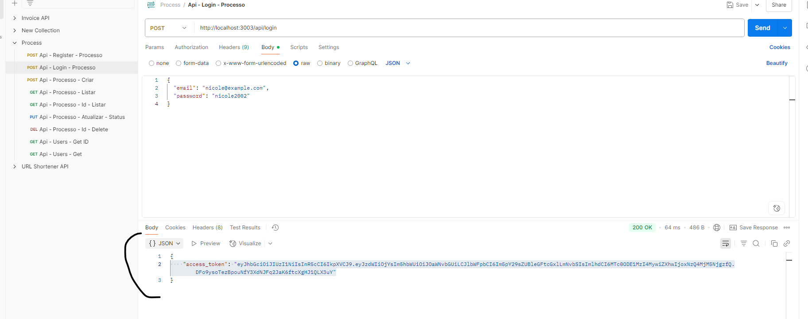
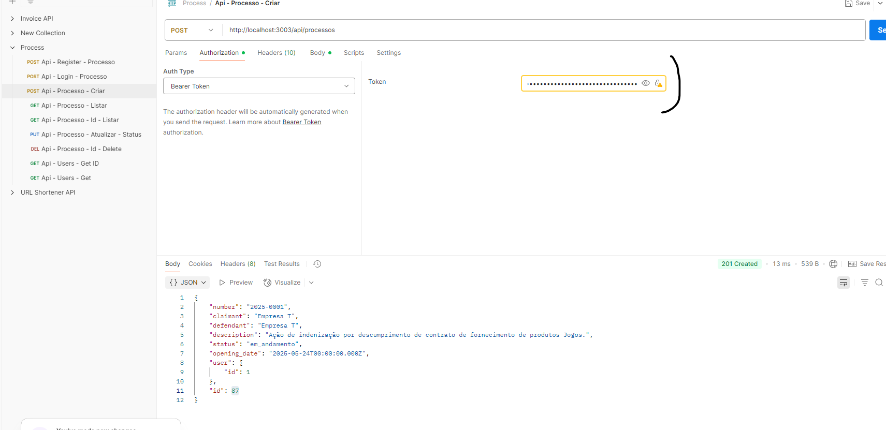

# 📑 Processo API

API REST para gerenciamento de processos jurídicos e usuários, desenvolvida com **Node.js**, **Express**, **TypeScript** e **TypeORM**, utilizando **MySQL** como banco de dados e autenticação com **JWT**.

---

## 🚀 Tecnologias Utilizadas

- Node.js
- Express
- TypeScript
- TypeORM
- MySQL
- JWT (Autenticação)
- Docker e Docker Compose

---

## 📦 Como executar o projeto

### ✅ Pré-requisitos

- [Node.js](https://nodejs.org/)
- [Docker](https://www.docker.com/) e [Docker Compose](https://docs.docker.com/compose/)

---

### 🔧 Configuração do ambiente

1. **Clone o repositório**

\`\`\`bash
git clone https://github.com/seu-usuario/seu-repo.git
cd seu-repo
\`\`\`

2. **Crie um arquivo `.env` (opcional)**

Já existem variáveis de ambiente definidas no código, mas você pode criar um arquivo `.env` para sobrescrevê-las se desejar.

Exemplo de `.env`:

\`\`\`env

# JWT

JWT_SECRET="eyJhbGciOiJIUzI1NiJ9.e30.ZRrHA1JJJW8opsbCGfG_HACGpVUMN_a9IV7pAx_Zmeo"
JWT_EXPIRATION_TIME="21600"

# MySQL (usando o nome do serviço do container como host)

MYSQL_HOST="127.0.0.1"
MYSQL_PORT="3307"
MYSQL_USER="bd-user-processo"
MYSQL_PASSWORD="processo1234"
MYSQL_DATABASE="bd_processo"

PORT="3003"
\`\`\`

---

### 🐳 Rodando com Docker

Execute o comando:

\`\`\`bash
docker-compose up --build
\`\`\`

A API estará rodando em: [http://localhost:3000](http://localhost:3000)

O banco de dados MySQL estará rodando na porta \`3307\`.

---

### 💻 Rodando localmente

1. Instale as dependências:

\`\`\`bash
npm install

# Importante: Antes de rodar a aplicação, execute obrigatoriamente o comando abaixo para gerar a pasta dist, que é onde ficará o código compilado do TypeScript:

npm run build

\`\`\`

2. Configure seu banco MySQL local com as credenciais:

\`\`\`bash
MYSQL_USER=bd-user-processo
MYSQL_PASSWORD=processo1234
MYSQL_DATABASE=bd_processo
MYSQL_PORT=3307
\`\`\`

3. Rode a aplicação:

- Para desenvolvimento:

\`\`\`bash
npm run build
npm run dev
\`\`\`

---

## 📚 Documentação da API

### 🔑 Autenticação

| Método | Endpoint      | Descrição           |
| ------ | ------------- | ------------------- |
| POST   | \`/login\`    | Login com JWT       |
| POST   | \`/register\` | Registro de usuário |

---

🔒 **Requer autenticação JWT**

---

### 📄 Processos

| Método | Endpoint           | Descrição                      |
| ------ | ------------------ | ------------------------------ |
| GET    | \`/processos\`     | Lista todos os processos       |
| POST   | \`/processos\`     | Cria um novo processo          |
| GET    | \`/processos/:id\` | Busca processo por ID          |
| PUT    | \`/processos/:id\` | Atualiza um processo existente |
| DELETE | \`/processos/:id\` | Remove um processo             |

### 👤 Usuários

| Método | Endpoint       | Descrição               |
| ------ | -------------- | ----------------------- |
| GET    | \`/users\`     | Lista todos os usuários |
| GET    | \`/users/:id\` | Busca usuário por ID    |

🔒 **Requer autenticação JWT**

---

## 🗄️ Banco de Dados

### 🔗 Tabelas principais

- \`users\` — Usuários do sistema.
- \`process\` — Processos jurídicos vinculados a usuários.

---

## 🔐 Autenticação

- JWT baseado em Bearer Token.
- Enviar o token no header:

\`\`\`

Como utilizar o token:

Realize o login na rota /login com seu e-mail e senha cadastrados.

A resposta trará um token no formato:

{
"access_token": "seu_token_aqui"
}

Utilize esse token no header das requisições que exigem autenticação:

Authorization: Bearer seu_token_aqui

Exemplo de como inserir o token no campo Authorization:

# Importante: O campo Bearer Token estiver vazio, adicione o token que foi gerado no campo access_token da resposta do login.

\`\`\`

---

## 🐞 Scripts disponíveis

| Comando           | Descrição                      |
| ----------------- | ------------------------------ |
| \`npm run dev\`   | Inicia em modo desenvolvimento |
| \`npm run build\` | Compila o TypeScript           |
| \`npm start\`     | Executa o projeto compilado    |

---

## 🐳 Docker Compose

| Serviço | Descrição                       | Porta     |
| ------- | ------------------------------- | --------- |
| app     | API Express com TypeScript      | 3000:3000 |
| mysql   | Banco de dados MySQL (processo) | 3307:3306 |

---

## 📂 Pasta docs

Dentro da pasta docs você encontrará uma collection do Postman (Process.postman_collection.json) que permite testar todos os endpoints da API de forma prática e rápida.

Basta importar o arquivo no Postman e começar os testes.

Imagens ilustrativas que mostram:

O funcionamento da API.

Exemplos de requisições e respostas.

Estrutura dos endpoints.

---

## 👨‍💻 Autor

Jefferson Meira  
💼 Desenvolvedor Full Stack
